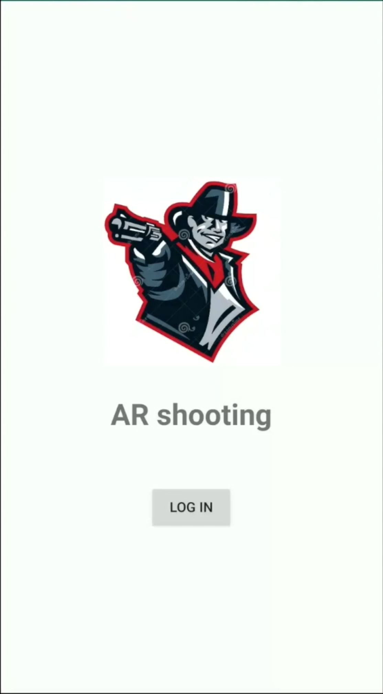
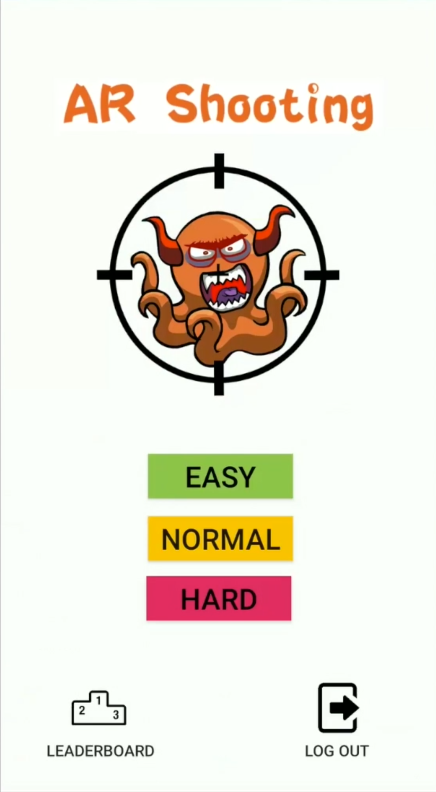
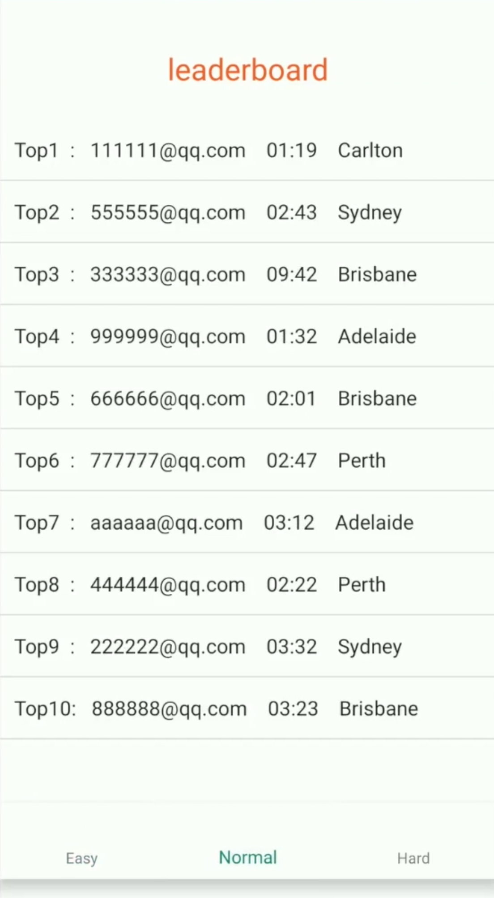
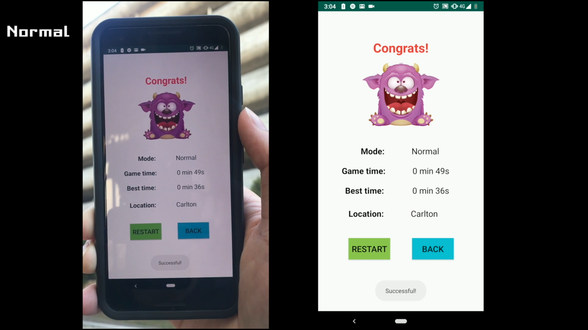
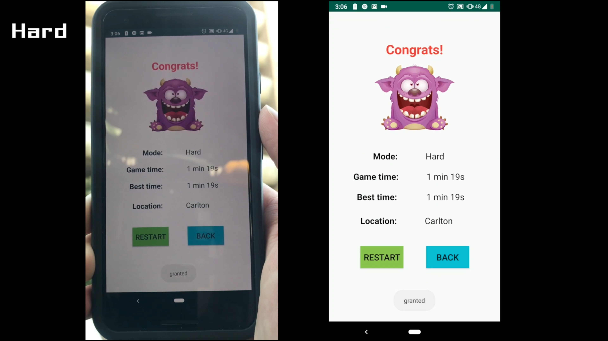

# AR_Shooting_Game

If run this app in the emulator, please install the "Google_Play_Services_for_AR_1.12.1_x86_for_emulator.apk" in the emulator.

If run this app in the phone, please install
"Google_Play_Services_for_AR_1.12.1.apk"

Link: https://github.com/google-ar/arcore-android-sdk/releases

# AR_Shooting_Game Introduction
### Goal
The goal of this game is killing 20 monsters by shooting. 

### Game Modes
There are three levels game modes:
1. Easy:
  The monsters doesn't move.
  Normal speed of the bullet

2. Normal:
  The monsters will falsh randomly with a normal speed.
  Normal speed of the bullet

3. Hard:
  The monsters will falsh randomly with a high speed.
  High speed of the bullet

### Score
Take the time to kill 20 monsters as the score in three game modes. Less time is better.

### Leaderboard
LeaderBoard shows the top 10 players in three game modes.

# AR_Shooting_Game Demo
Youtube Link:
https://youtu.be/dkOADBYYbYA

