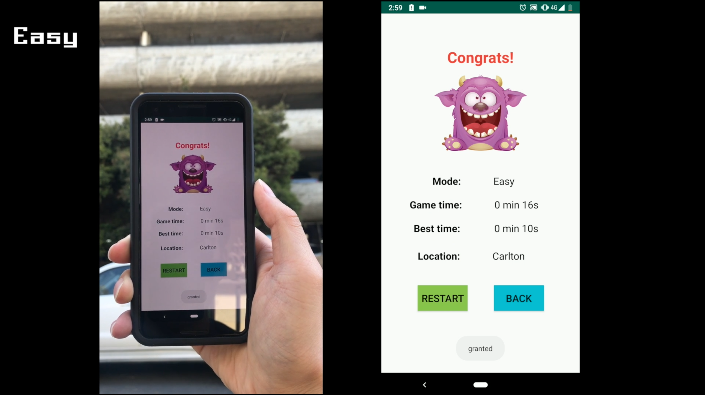

# AR_Shooting_Game

If run this app in the emulator, please install the "Google_Play_Services_for_AR_1.12.1_x86_for_emulator.apk" in the emulator.

If run this app in the phone, please install
"Google_Play_Services_for_AR_1.12.1.apk"

Link: https://github.com/google-ar/arcore-android-sdk/releases

# AR_Shooting_Game Demo
Youtube Link:
https://youtu.be/dkOADBYYbYA

